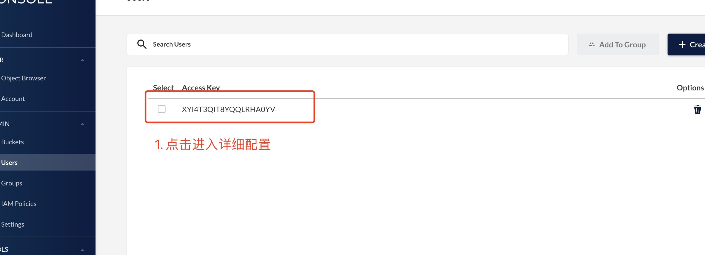

[toc]

# 组件及服务配置

## 网关服务 gateway.toml
```shell
[[modules]]
    Name = "wallet"
    IsEnabled = false
    EndPoints = ["", ""]   # changeme (1. 红包服务 http 服务地址, 2. 钱包服务 http 服务地址)

[[modules]]
    Name = "redPacket"
    IsEnabled = false
    EndPoints = ["", ""]   # changeme (1. 红包服务 http 服务地址, 2. 钱包服务 http 服务地址)

[[modules]]
    Name = "oa"
    IsEnabled = false
    EndPoints = ["http://oa-gateway:20000"]        # changeme (oa 服务地址)

[[modules]]
    Name = "shop"
    IsEnabled = false
    EndPoints = [""]     # changeme (链上购服务地址)

[[modules]]
    Name="live"
    IsEnabled= false
    EndPoints=[""]

[Revoke]
    Expire = "86400h" #ten years (撤回消息有效时间)
```
- modules：各模块起用配置
  - Name：模块名称
  - IsEnabled：是否起用
  - EndPoints：服务访问相关地址

## 文件存储服务
### MINIO配置说明

docker启动Minio服务容器后，需要对Minio的Bucket和权限等进行配置。


- 控制台默认为`localhost`:`9000`端口。
- 控制台的账号默认为`minio`，密码随机生成（在docker compose 启动目录的.env文件中）。

进入控制台后按如下步骤配置：

1. 配置Buckets


2. 配置访问用户


3. 配置用户权限


4. 为Bucket修改可见性


### dtalk-OSS服务配置 oss.toml

启动oss服务后，需要对默认配置进行修改，具体配置如下：


- OssType: 可以选择云服务厂商如阿里云、华为云；这边我们选择自建Minio
- AccessKeyId和AccessKeySecret是需要给到客户端的，与上面MINIO【2. 配置访问用户】中一致
- PublicUrl：host_ipaddress 要修改成oss服务所在机器ip或域名(公网访问地址)

## 短信邮箱验证服务 backup.toml

- Surl: 短信云服务地址，目前只支持PHP适配服务。
- AppKey：PHP适配服务方颁发。
- SecretKey: PHP适配服务方颁发。
- Msg: PHP适配服务方提供，最后一位数字表示验证码长度
- Env：线上-release, 测试-debug(当env为debug时，mock服务开启，验证码长度由msg指定)
- Whitelist：白名单列表，无论是debug模式还是release模式都放行。

## 音视频信令服务 call.toml

目前只支持腾讯云音视频服务

## 节点发现服务 discovery.toml
```shell
[server]
    addr="0.0.0.0:18001"

[redis]
    network="tcp"
    addr="txchat-redis:6379"
    auth=""
    active=60000
    idle=1024
    dialTimeout="200ms"
    readTimeout="500ms"
    writeTimeout="500ms"
    idleTimeout="120s"
    expire="30m"

[[CNodes]]
name=""
address=""

[[DNodes]]
name=""
address=""
```
- CNodes: 聊天服务对外访问节点信息
  - name：名称
  - address：对外暴露地址如（http://localhost:8888）
- DNodes: 通讯录节点信息
  - name: 名称
  - address：对外暴露地址如（http://localhost:8901）

## 三方推送服务 offline-push.toml
```shell
# 友盟离线推送物料
[pushers]
    [pushers.Android]
    Env = "release"
    AppKey = ""
    AppMasterSecret = ""
    MiActivity = ""

    [pushers.iOS]
    Env = "debug"
    AppKey = ""
    AppMasterSecret = ""
    MiActivity = ""
```
- AppKey: 移动端提供
- AppMasterSecret: 移动端提供


## SLG特有

### 网关服务 gateway-toml
```shell
[SlgHTTPClient]
    Host = "https://xxx.xxx.cn"
    Salt = "xxxx"
```
- SlgHTTPClient:
  - host：slg后端服务地址
  - salt：slg后端服务访问秘钥

### 自动移除服务 kickout.toml

```shell
env="release"
#Field name   | Mandatory? | Allowed values  | Allowed special characters
#----------   | ---------- | --------------  | --------------------------
#Seconds      | Yes        | 0-59            | * / , -
#Minutes      | Yes        | 0-59            | * / , -
#Hours        | Yes        | 0-23            | * / , -
#Day of month | Yes        | 1-31            | * / , - ?
#Month        | Yes        | 1-12 or JAN-DEC | * / , -
#Day of week  | Yes        | 0-6 or SUN-SAT  | * / , - ?
# https://pkg.go.dev/github.com/robfig/cron#Cron.AddFunc
#TaskSpec="00 00 00 * * *"

TaskSpec="00 0-59/5 * * * *"

[log]
    Level="info"
    Mode="console"
    Path=""
    Display="json"

[GroupRPCClient]
    RegAddrs = "txchat-etcd:2379"
    Schema = "dtalk"
    SrvName = "group"
    Dial = "1s"
    Timeout = "1s"

[SlgHTTPClient]
    Host = "https://xxx.xxx"
    Salt = "xxx"
```
- TaskSpec: 定时执行策略
  - "00 00 00 * * *"： 为每天0点
  - "00 0-59/5 * * * *" 为每五分钟一次
- SlgHTTPClient: 
  - host：slg后端服务地址
  - salt：slg后端服务访问秘钥

### vip服务 vip.toml
```shell
Whitelists=[
    "1CX8txxxxxxxxxxxxxxxxxxxxxxR1qTYPK",
    "1H5QzxxxxxxxxxxxxxxxxxxxxxLrUU9H8A"
]
```
- vip白名单